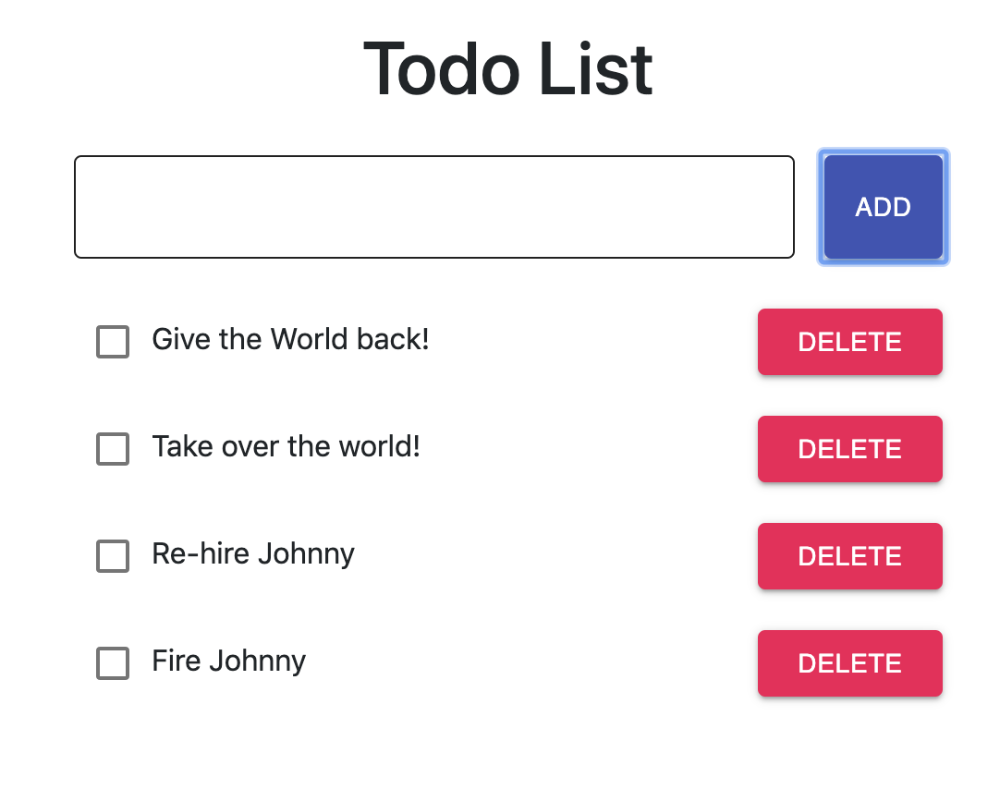

## Description

Simple ToDo application, ToDo lets you create new tasks and delete then when the task is done. You can also use the checkboxes to mark a todo as done but not delete it.
This app has a friendly user experience with instant visual updates that is  connected to a backend with a real time db using Reshuffle.
Build with React and Reshuffle platform.

  

